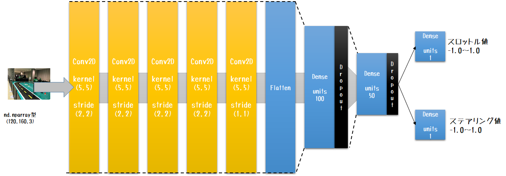
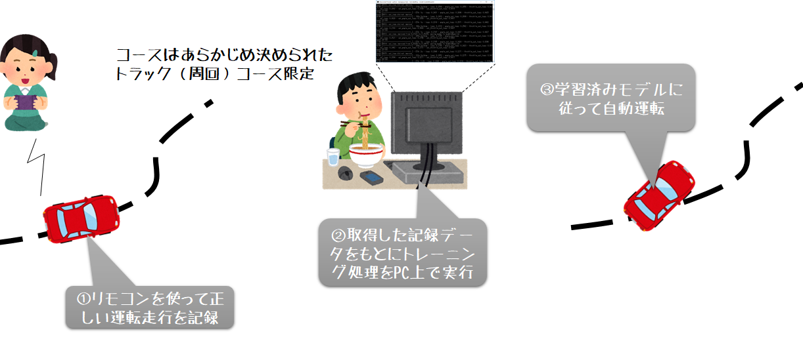
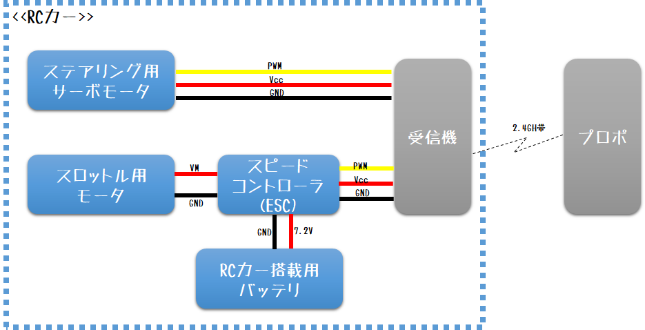
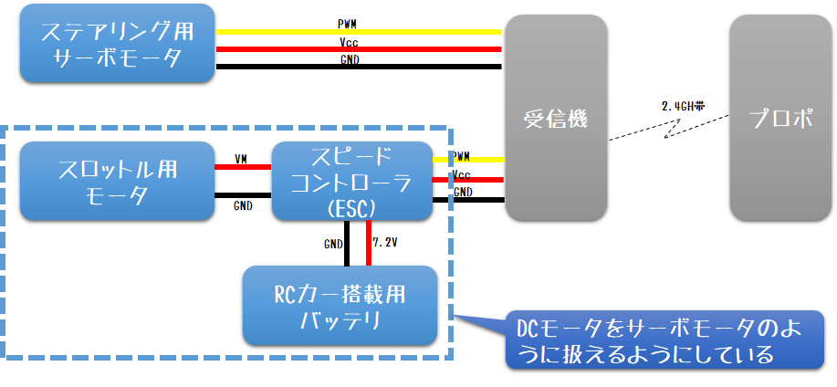
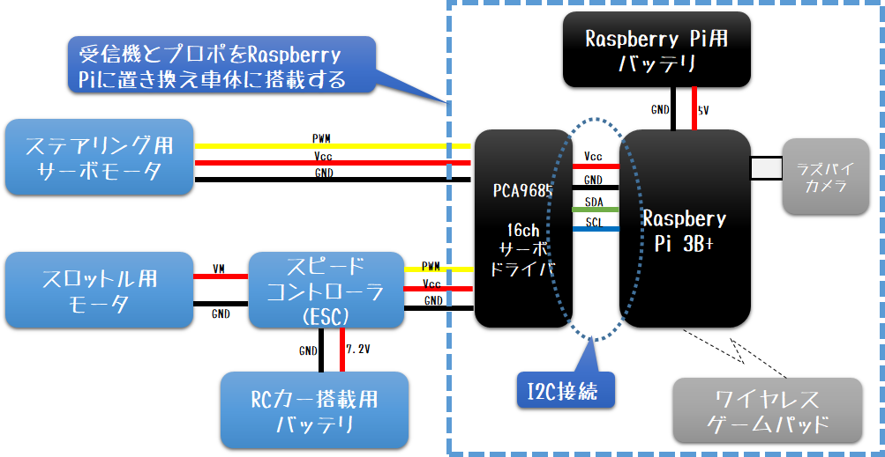
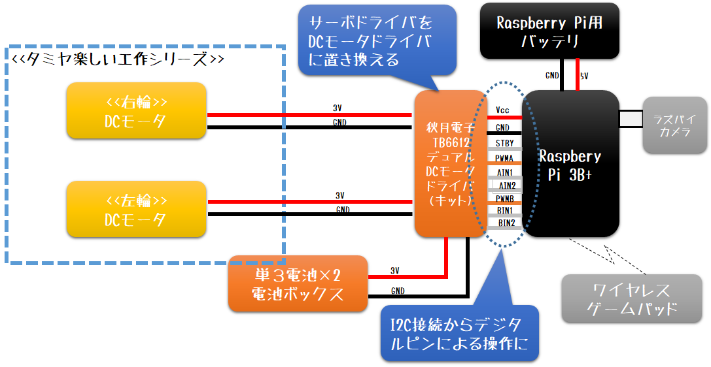

# タミヤ楽しい工作シリーズを Donkey Car 化する

## 1 Donkey Car とは

Raspberry Pi や市販のRCカーなど比較的入手しやすい部品を使って、自律走行を実現するためのMIT準拠のオープンソースおよびドキュメントです。

通常は市販のRCカーを使いますが、今回はタミヤの [楽しい工作シリーズ(セット) No.104 2チャンネルリモコン ブルドーザー工作基本セット](https://www.tamiya.com/japan/products/70104/index.html) をベース車体にして作ってみました。

### 1.1 Donkey Car の用意

Donkey Carを始めるには、ドキュメントに従って、各自で部品を調達し、 Donkey Car を組み立て、ソフトウェアを導入・設定を行う必要があります。DIYが得意ではない方や、プログラミングやソフトウェアに詳しくない方でも参加できるように、コミュニティでは標準 Donkey Car キットを販売しているので、こちらをまず購入することをおすすめします。

> 私も最初のDonkey Carは香港の [Robocar Store](https://www.robocarstore.com/) で購入して組み立てました。その際の組み立て方は [こちら](https://www.slideshare.net/HoriTasuku/donkey-car) を参照してください。

### 1.2 自律走行までの流れ

Donkey Car における自律走行は、周回コースをできるだけ早く走行することを目的としています。
このため、指定された場所で人やモノを乗せ、移動するといった、複雑な自律走行はできません。

Donkey Carのデフォルト自律走行モデルでは"教師あり機械学習"を採用しています。

> Donkey シミュレータを使った強化学習モデルを扱うことも可能。



入力データは前方に搭載されたカメラの画像(120x160x3)、出力データはRCカーのステアリング・スロットルへの出力値(float×2)を使用します。ただしDonkey Carにはいくつか別のモデルも用意されており、入力データや出力データが異なるものも存在します。

> Donkey Car 3.1 にて用意されているモデル群は [こちら](https://fight-tsk.blogspot.com/2019/09/donkeycar310.html) を参照してください。



デフォルトのモデルを使用する場合、"教師あり"ですので、まず学習データを収集しなくてはなりません。Donkey Carの構築が完了したら、 ①Donkey Car を手動運転して学習データを収集し、②トレーニング処理を実行、③完成したモデルをつかって自律走行をおこないます。

## 2 Donkey Car のしくみ

### 2.1 RCカー

タミヤの1/10スケールなどの一般的なホビー用のRCカーの仕組みは、以下の図のような構成となっています。



プロポとは操作用のコントローラのことで、車体に搭載する受信機とペアで販売されています（灰色の部分）。車体のみを購入した場合は、受信機を車体に組み付ける必要があります。

RCカーのステアリングはサーボモータで動かしており、ステアリング用サーボからの③本ケーブルを受信機にとりつけます。

強力なスロットル用のモータは、RCカーバッテリから宮殿を行いますが、直接接続されるのではなくスピードコントローラと呼ばれるマッチ箱より大きな箱に接続されます。スピードコントローラは、受信機から受けた指示に従って、調節された電気量をスロットル用モータへ送ります。

タミヤのブルドーザは、ステアリング用・スロットル用のモータではなく、左駆動輪・右駆動輪を動かすためのモータであるため、ジョイスティックやWeb画面からの操作入力を各々のモータの入力値に変更する必要があります。

### 2.2 Donkey Car（ハードウェア）

受信機から見ると、２つのサーボモータを操作しているのとかわりません。



Donkey Car は、この受信機とプロポに当たる部分を、サーボコントローラで代替している構成になっています。



サーボコントローラは、Raspberry PiなどGPIOを搭載したマイクロコンピュータでサーボモータを操作できるようにした基板です。標準 Donkey Car では PCA9685 という16ch、つまり最大16個のサーボモータを操作が可能な基板を採用しています。

サーボモータは、GND(-)、Vcc(3.3V)、PWMの3つのケーブルで接続します。PWMとは、デジタル出力ピン(0か1)をつかって擬似的なアナログ出力を実現する方法です。

しかし、Raspberry PiのGPIOにはPWMをハードウェアレベルで実装しているピンは4本、同時に複数の波形をだしたい場合は2本しかありません。

2台以上のサーボモータを操作する場合は、PCA9685などのドライバ経由で使用します。

PCA9685は、I2Cという形式でRaspberry Piへ接続するため、複数台のサーボモータを少ないピン数(GND,Vcc含め4本)ですみます。

今回使用するタミヤのブルドーザは、マブチFA-130RA小型直流モータ(の互換モータ)を使用しています。ミニ四駆で使用されていたモータと同型です。当然、サーボモータドライバでは操作することはできません。そこで 秋月電子の [TB6612使用 Dual DCモータドライブキット](http://akizukidenshi.com/catalog/g/gK-11219/) を変わりに使用しました。



TB6612 Dual DC モータドライブは、1枚の基板で2つのDCモータを操作できますが、I2C接続ではないため全部で8ピン消費します。

またFA-130RAの使用電圧範囲は1.5V～3.0V(適正電圧1.5V)なので、RCカーのバッテリ(7.2V)を直接接続することはできません。このため単3電池2本を直列に接続した電池ボックスをかわりに搭載します。

### 2.3 ソフトウェア

Donkey Car はPythonで記述されています。Pythonがわからない人でも、標準Donkey Carを動かす場合は、知識は殆どなくてもかまいません。

しかし、今回のようなサーボモータドライバをDCモータドライバへ変更するなどの改変を行う場合は、プログラムの追加や書き換えが必要になります。

Donkey Car 上のマイクロコンピュータへ Donkey Car ソフトウェアをドキュメント通りにインストールした場合、 `manage.py` というモジュールが起動のエントリポイントとなります。

第一引数に`drive`を渡すと、手動・自動運転処理が実行されます。`train`を渡すと、トレーニング処理が実行されます。

> `drive`を指定した場合の手動・自動の切替はプロポにあたるゲームパッドやスマートフォンの操作で行います。

今回は機械学習モデルの入力データ、出力データの変更は行わないので、`drive`を指定した場合のみ、すなわち `manage.py` 内の関数`drive()`内が改変箇所になります。

#### 2.3.1 Vehicle フレームワーク

Donkey Car はPythonパッケージ donkeycar と、このパッケージを使って実際に（手動・自動）運転、トレーニングを行う実行プログラムで構成されています。

これらのプログラムは `donkeycar.vehicle` 上の `Vehicle` クラスをつかったフレームワーク（ここでは vehicle フレームワークと呼称）ベースで実装されています。

```python
:
import donkey as dk
:
# Veicleオブジェクトの生成
V = dk.vehicle.Veichle()
:
# パーツの追加
core_fighter = anaheim.core.Fighter()
V.add(core_fighter, outputs=[
    'amuro/left/arm', 'amuro/right/arm',
    'amuro/left/leg', 'amuro/right/leg'],
    threaded=True)
a_part = anaheim.rx_78.APart()
V.add(a_part,
    inputs=['amuro/left/arm', 'amuro/right_arm'])
b_part = anaheim.rx_78.BPart()
V.add(b_part,
    inputs=['amuro/left/leg', 'amuro/right/leg'])
:
# Veichleループの実行(1秒間20回、100,000回迄)
V.start(start_hz=20,
    max_loop_count=100000)

```

使い方は簡単で、`Vehicle` オブジェクトを生成しパーツとよばれるクラスを追加(`add`)してから、最期にループを`start`させると、指定した引数に従ってパーツクラスが`add`された順番に実行されます。

パーツクラス間の値のやりとりは、パーツを`add`する際に指定した`inputs`および`outputs`で指定したキーに格納されている辞書`V.mem`の値を使います。

> `start`する前に初期値を設定したい場合は、例えば `V.mem['amuro/left/arm'] = 0.0` と書くことで指定できます。

#### 2.3.2 パーツクラス

Veicleが`start`すると、`add`された順番で各クラスの`run`メソッド(`threaded=True`の場合は`run_threaded`メソッド)が呼び出されます。

`run` メソッドの引数は、`add`された際の`inputs`に指定された値が格納されます。`run` メソッドの戻り値は、`outputs`に指定されたキーの値としてフレームワーク側`V.mem`に格納されます。

Veicleフレームワークは指定された周期(`rate_hz`)でループが実行されますが、基本シングルスレッドで処理するため、`run`メソッドの処理時間が長くなると周期をまもることができません。そのため１回の処理が長くなりそうなパーツはマルチスレッドパーツとして実装します。

マルチスレッドパーツは、`run`メソッドの代わりに`run_threaded`メソッドを実装します。マルチスレッドパーツが生成されると、別のスレッドが生成され定期的に引数なしの`update`メソッドが実行されます。Veicleフレームワーク側のメインスレッドはループの周回ごとに`run_threaded`を呼び出します。このため、一般的な使い方はセンサなどの読み取りパーツに使用されます。`update`メソッド内でセンサから読み取った値をクラス内インスタンス変数へ格納し、`run_threaded`メソッドではセンサからではなくインスタンス変数の値をVeicleフレームワーク側へ出力するといった実装を行います。

>マルチスレッドパーツ内に以下の`run`メソッド実装を行うことで、シングルスレッドパーツとしても使用可能なクラスになります。
>
> ```python
> def run(self,.. ):
>     self.update()
>     return self.run_threaded(.. )
> ```

以下の表は、デフォルト状態で`python manage.py drive`を実行した際にVeicleループで処理されるパーツクラスリストです。

|パーツクラス|`inputs`|`outputs`|`threaded`|用途|
|:--|:--|:--|:-:|:--|
|`PiCamera`|N/A|`['cam/image_array']`|`False`|Piカメラ撮影画像を取得|
|`LocalWebController`|`['cam/image_array']`|`['user/angle', 'user/throttle', 'user/mode', 'recording']`|`True`|Web画面から入力された値を取得|
|`ThrottleFilter`|`['user/throttle']`|`['user/throttle']`|`False`|後進する際一旦スロットル値をゼロにする|
|`PilotCondition`|`['user/mode']`|`['run_pilot']`|`False`|運転モード3値(文字列)をBoolean化|
|`RecordTracker`|`["tub/num_records"]`|`['records/alert']`|`False`|一定件数ごとにアラート表示|
|`ImgPreProcess`|`['cam/image_array']`|`['cam/normalized/cropped']`|`False`|`run_condition`が真値の場合のみ画像を指定値だけ上下左右を削除してリシェイプ|
|`FileWatcher`|N/A|`['modelfile/modified']`|`False`|指定ファイルの更新有無判定|
|`FileWatcher`|N/A|`outputs=['modelfile/dirty']`|`False`|`ai_running`が真の場合のみ指定ファイルの更新有無判定|
|`DelayedTrigger`|`['modelfile/dirty']`|`['modelfile/reload']`|`False`|`ai_running`が真の場合指定件数ごとに真値を返却|
|`TriggeredCallback`|`["modelfile/reload"],`|N/A|`False`|`ai_running`が真の場合指定メソッドを実行|
|`KerasLinear`|`'cam/normalized/cropped']`|`['pilot/angle', 'pilot/throttle']`|`False`|`ai_running`が真の場合機械学習モデルの推論を実行|
|`DriveMode`|`['user/mode', 'user/angle', 'user/throttle', 'pilot/angle', 'pilot/throttle']`|`['angle', 'throttle']`|`False`|運転モードに合わせて最終出力値を決定|
|`AiLaunch`|`['user/mode', 'throttle']`|`['throttle']`|`False`|機械学習モデル初期起動時から安定するまで一定スロットルを維持|
|`AiRunCondition`|`['user/mode']`|`['ai_running']`|`False`|自動運転中かどうかを判別|
|`AiRecordingCondition`|`['user/mode', 'recording']`|`['recording']`|`False`|自動運転中の場合常に記録モードを有効化|
|`PWMSteering`|`['angle']`|N/A|`False`|入力値をステアリングサーボへ伝達|
|`PWMThrottle`|`['throttle']`|N/A|`False`|入力値をスロットルモータ(ESC)へ伝達|
|`TubWriter`|`['cam/image_array','user/angle', 'user/throttle', 'user/mode']`|`["tub/num_records"]`|`False`|`ai_recording`が真値の場合、Tubデータを１件書き込み現在件数を取得|

上記のうちPCA9685を直接操作しているパーツクラスは、`PWMSteering`と`PWMThottle`の2つ。先の入力値を両輪駆動モータ値に変換する機能とこれらの変わりのTB6612へ出力するクラスを作成、追加しなくてはなりません。


## 3 ブルドーザの制作

詳しい手順はGitHub側のドキュメントを参照してください。

* [GitHub: coolerking/caterpillar](https://github.com/coolerking/caterpillar)

以下、いくつかの補足です。

### 3.1 TB6612 使用 Dual DCモータドライブキット

このキットを完成させるためには、はんだ付けが必要です。

この基板にはSTBYピンがあります。HIGHにするとモータドライブが使用可能になり、LOWにすると使用不可になります。今回はこのピンをRaspberry Piにつないでいますが、これは開発初期の頃、よくハングアップさせモーターが動きっぱなしになることがあったため、外部のプログラムからSTBYピンをLOWにできるようにしたためです。

基板上にJP1とプリントされた箇所があり、ここをはんだ付けしてショートさせるとSTBYは不要になります。JP1はTB6612の近くにあるため、うっかりはんだごてをTB6612に当てると動作しなくなることがあります。

### 3.2 Rasppi Camera

今回は標準Donkey Carで使用しているWide Angleカメラではなく、通常のRacpberry Piカメラを使用しています。これはカメラケースに入れたかったからなので、Wide Angleカメラでもかまいません。

### 3.3 Elecom JC-U3912T ワイヤレスゲームパッド

私が参加させていただいている走行会では Logicool F710 ワイヤレスゲームパッドを使用している方が多く、混戦する可能性があります。混戦してしまうと、これまで収集した学習データの編集が大変なので、再度いちから学習し直すことになります。
