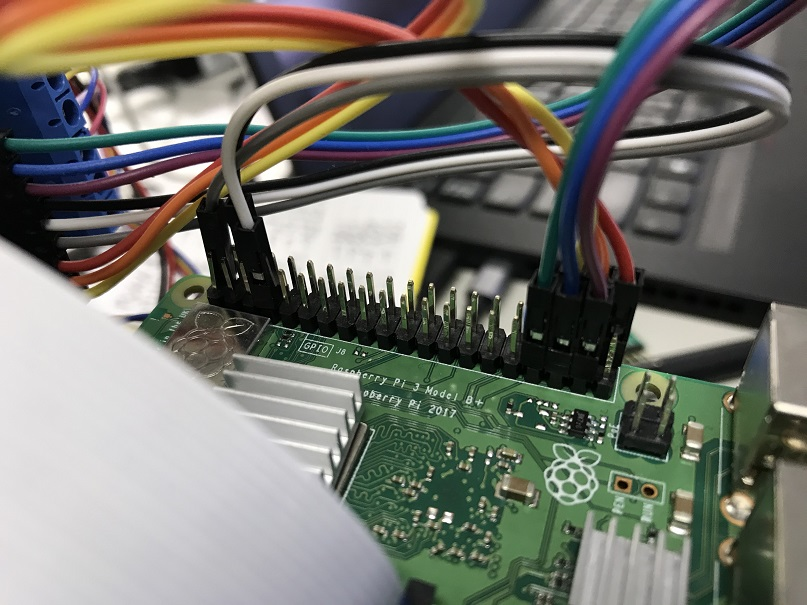
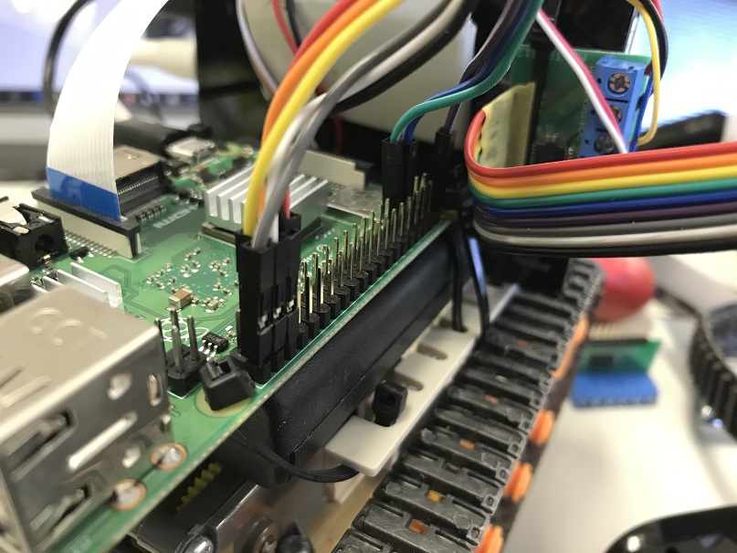
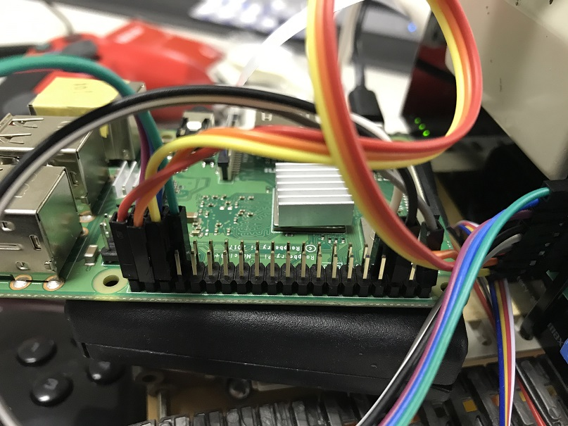
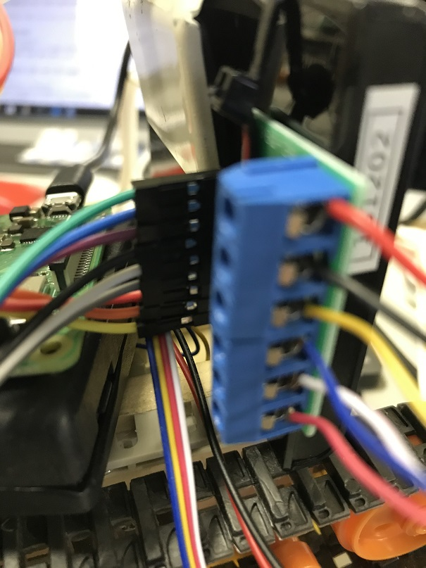
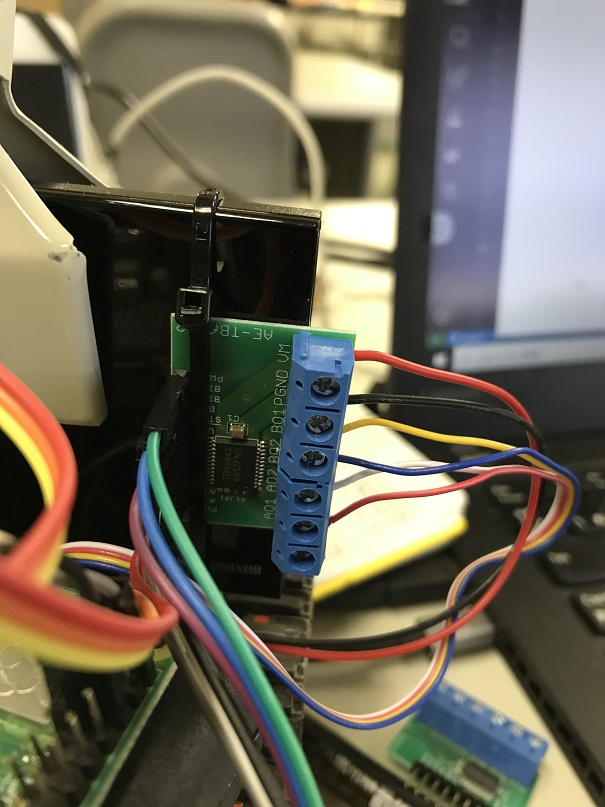

# 配線リスト

## TB6612

* JP1はショートさせない(GPIO4を使用)
* ピンヘッダはターミナルボックス側に立ててはんだ付けする

## TB6612からRaspberry Piまで

### 3本帯ケーブル

| **TB6612** | **ジャンパ** | **Raspberry Pi** | **備考** |
|:-:|:-:|:-:|:-|
|PWMA|黄|GPIO16|USB外側右下から3番目|
|AIN2|橙|GPIO20|USB外側右下から2番目|
|AIN1|赤|GPIO21|USB外側右下から1番目|
|VCC|灰|5V|USB外側右上から1番目|
|STBY|白|GPIO4|USB内側左上から4番目|
|GND|黒|GND|USB外側右上から3番目|
|BIN2|紫|GPIO26|USB内側左下から2番目|
|BIN1|青|GPIO19|USB内側左下から3番目|
|PWMB|緑|GPIO13|USB内側左下から4番目|

### 9本帯ケーブル

| **TB6612** | **ジャンパ** | **Raspberry Pi** | **備考** |
|:-:|:-:|:-:|:-|
|PWMA|黒|GPIO16|USB外側右下から3番目|
|AIN2|白|GPIO20|USB外側右下から2番目|
|AIN1|灰|GPIO21|USB外側右下から1番目|
|VCC|紫|5V|USB外側右上から1番目|
|STBY|青|GPIO4|USB内側左上から4番目|
|GND|緑|GND|USB外側右上から3番目|
|BIN2|黃|GPIO26|USB内側左下から2番目|
|BIN1|橙|GPIO19|USB内側左下から3番目|
|PWMB|赤|GPIO13|USB内側左下から4番目|

* メスメスのジャンパ線を使用する

## DCモータからTB6612まで

| **DCモータ** | **コード** | **TB6612** | **備考** |
|:-:|:-:|:-:|:-|
| 左モータ上側 | 黄 | B01 | ターミナル|
| 左モータ下側 | 青 | B02 | ターミナル|
| 右モータ下側 | 赤 | A01 | ターミナル|
| 右モータ上側 | 白 | A02 | ターミナル|

## DCモータ電源からTB6612まで

| **DCモータ電源** | **コード** | **TB6612** | **備考** |
|:-:|:-:|:-:|:-|
| 電池ボックス黒 | 黒 | VM | ターミナル |
| 電池ボックス赤 | 赤 | GND | ターミナル側のGND |

