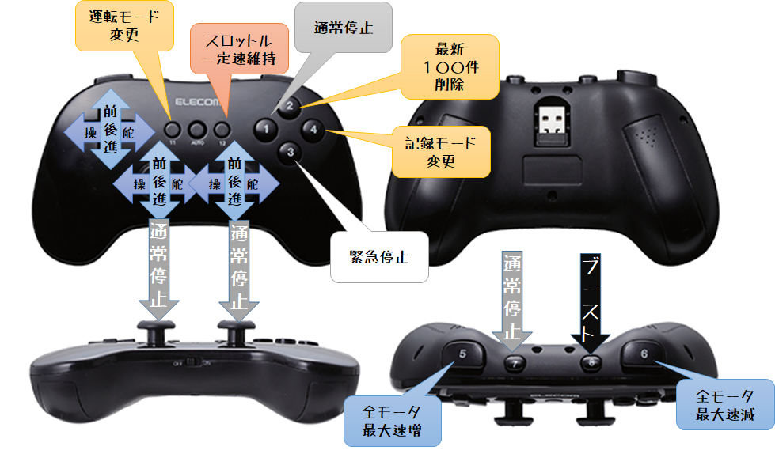

# Elecom JC-U3912T 操作方法

| **JC-U3912T** | **操作** | **備考** |
|:-:|:-:|:-|
| 十字キー上 | 全速前進 | 離すと速度ゼロ |
| 十字キー下 | 全速後進 | 離すと速度ゼロ |
| 十字キー左 | 全速左折 | 離すと速度ゼロ |
| 十字キー右 | 全速右折 | 離すと速度ゼロ |
| 右アナログ上 | スロットル前進 | 離すとスロットルゼロ |
| 右アナログ下 | スロットル後進 | 離すとスロットルゼロ |
| 右アナログ左 | アングル左へ | 離すとアングルゼロ |
| 右アナログ下 | アングル右へ | 離すとアングルゼロ |
| 右アナログ押込 | 通常停止 | |
| 左アナログ上 | スロットル前進 | 離すとスロットルゼロ |
| 左アナログ下 | スロットル後進 | 離すとスロットルゼロ |
| 左アナログ左 | アングル左へ | 離すとアングルゼロ |
| 左アナログ下 | アングル右へ | 離すとアングルゼロ |
| 左アナログ押込 | 通常停止 | |
| 11 (select相当) | 運転モード変更 | user_angle>local>user とトグルされる |
| 12 (start相当) | 一定速走行変更 | トグルでON/OFFされる |
| 1 (□相当) | 通常停止 | |
| 2 (△相当) | 最新100件削除 | 失敗した時Tubデータを少し削除できる |
| 3 (×相当) | 緊急停止 | |
| 4 (○相当) | 記録モード変更 | トグルでOFF/ONされる |
| 5 (LT/L1相当) | 最高速増加 | 速度が上がる |
| 6 (RT/R1相当) | 最高速減少 | 速度が下がる |
| 7 (LBL2相当) | 通常停止 | |
| 8 (RB/R2相当) | ブーストON | 押すとブーストが有効になる |

* 本体下面に電源スイッチがあるので、運転プログラムを開始する前にONにすること
